# Face Mask Detection (CNN)

- :star2: **Found this repository helpful?** Light it up with a star and make my day! :wink: 
---
### Overview
- Amid the COVID-19 pandemic, enforcing mask regulations has become paramount. We developed a face mask detector that operates in real-time, leveraging Python, PyTorch, and OpenCV. Our tool classifies individuals in images or videos as wearing a mask correctly or not. It is tailored for high traffic venues, such as airports or subway stations, to oversee mask compliance.

### Core Algorithms:
- Face Detection: We employ the Viola and Jones method using OpenCV's haarcascade_frontalface_default.xml due to its balance between speed and accuracy, making it suitable for real-time detection. We chose this after several trials with other classifiers that lacked precision, especially when detecting masked faces.

- Mask Predictor: A Convolutional Neural Network (CNN) serves as our mask predictor. This CNN uses a two-layer convolution structure inspired by garment classification networks and has shown more than 90% accuracy in our tests.
Dataset:
We sourced our training, validation, and testing data from a public repository, containing 2,165 images with masks and 1,930 without. Images are shuffled during each training session.

### Application:
- Our model works on both live video feeds and static images. Detected faces are highlighted with rectangles indicating if a mask is present or absent. We also provide a GUI, constructed using tkinter, for user-friendly interactions.

### Parameter Tuning:
- The chosen parameters are based on our testing results and research. Our emphasis was on efficiency, given the real-time application nature, hence the selection of faster algorithms even if slightly sacrificing accuracy. Details on our parameter tuning and selection process, along with challenges encountered, are available in the main documentation.
---
## 0. Setup
1. Clone the repo
2. Run train.py file to train the model. The trained model will be store in './pretrain_model/MaskDetection_model.pk'
3. Run test.py file to get the 
   - accuracy = (TP+TN)/(TP+TN+FN+FP)
   - recall = TP/(TP+FN)
   - specificity = TN/(TN+FP)
   - precision = TP/(TP+FP)
   - f1_score = 2*recall*precision/(recall+precision)
4. Run GUI.py file
---
## 1.      Background

Since the covid-19 pandemic outbreak in 2019, the Hong Kong government has enacted a series of epidemic prevention regulations, which include the requirement for people to wear masks in public places. In crowded places, proper wearing of masks can effectively reduce the transmission rate of covid-19 virus. However, after the vaccine  **coverage** rate gradually increased and the normalization of the epidemic, some citizens took a chance to take off their masks in the streets, airports and other public places. For the purpose of implementing epidemic prevention measures and the sake of public health, it is necessary to set up a detector in public places to detect whether people are wearing masks or not.

## 2.      Motivation

It is still an open question how to effectively and strictly enforce several covid-19 prevention regulations. According to the government's anti-epidemic regulations on masks, we developed a face mask detector based on python, pytorch, and opencv. The model considers whether to wear a mask correctly as a simple binary classification problem: with or without. The higher probability class is given as the classification result. The input to the detector can be an image or a live video containing multiple people. This detector will be used to scan and monitor people's mask wearing in real time in high traffic places such as airports, subway stations, and streets.

## 3.      Research

Because the target objects in the images may have different aspect ratios and spatial locations, the CNN needs to segment many regions of different sizes. These redundancies can waste a lot of computational power. Before starting to implement this detector in code, we considered using RCNN, Fast-RCNN, Faster-RCNN and YOLO. For RCNN and its improved version, it involves selective search based on color, shape, etc. and finally obtains the region of Interest. For YOLO, it divides the input image into G*G grids and uses CNN to do the entire image's detection for only one time. These are all aimed at processing images with redundant backgrounds.

 

But since we found a suitable dataset in the process of implementation, which is already labeled and cropped. The information of the whole image is useful information so it can be directly used for neural network training because it has no unnecessary background.

## 4.      Algorithms and Reasons:

### 4.1. Face detection: Viola and jones

The classifier we use is Opencv's haarcascade_frontalface_default.xml.

Before choosing it, we also made three failed attempts. The first two attempts used haarcascade_frontalface_alt.xml and haarcascade_frontalface_alt2.xml classifiers, but they did not work well for faces with mask, probably because the model was not trained to take into account the mask obscuring the face. The first two attempts can only detect faces without masks, but our predictor needs to perform mask prediction based on the cropped images after face detection, which means that the classifiers of the first two attempts are not desirable. Because the first two attempts we found that the classifier was unable to recognize the bottom part of the face when it was masked, and the third attempt was with a classifier about the eyes. We have tried harcascade_lefteye_2splits.xml and harcascade_eye.xml. These two classifiers are used together with harcascade_nose.xml. When the eyes and nose are recognized, the object is also determined as a face. The third method can recognize faces with masks, but the accuracy is not high and often misclassifies non-face backgrounds as non-face areas.

 

Because our face mask detector involves real-time video detection, the entire detector requires high speed including initial face localization. Viola and Jones is a very classical face detection algorithm. The reason why we choose it as our face detector is that Its fast and efficient features meet our time and accuracy requirements.

The core of Viola and Jones algorithm is to describe the face features by using the Haar feature that separates light from dark. There are two main reasons why Viola and Jones algorithm is fast in face recognition. Firstly, the integral image avoids repetitive operations. Secondly, the cascade of classifiers, which cascades several adaboost classifiers, uses some simple features to eliminate most of the easily distinguishable non-face regions at first, and then uses more complex features to eliminate the more complex non-face regions. The cascade of classifiers initially uses a small number of features to exclude most of the easily distinguishable non-face regions, and later uses more complex features to remove more complex non-face regions.

Another reason why we chose Viola and Jones is that it maintains a good accuracy rate with high efficiency. Viola and Jones algorithm uses the Adaboost algorithm for feature selection, weak learner training and classifier training to combine weak classifiers into strong classifiers. This algorithm will pay more attention to the samples that are more complex and more prone to misclassification because in each round, it will raise the weight of the false positive samples in the previous level.

 

### 4.2. Mask predictor: CNN

Face mask detector we used CNN model.The model is divided into two parts: feature learning and classification. feature learning: Convolution+Relu, pooling, Convolution+Relu, pooling; classification: Flatten,fully connected,softmax. pooling; Classification: Flatten,fully connected,softmax.For details, please refer to the following figure, which contains the specific parameters.

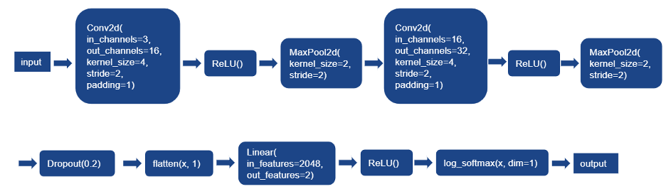

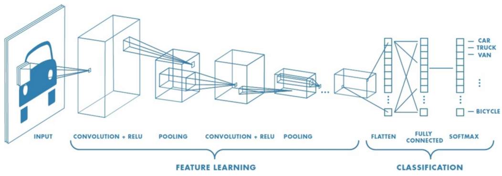

#### 4.2.1. Two-layer convolution 

We choose the two-layer convolution as the feature learning by referring to the article in research and the project of COMP3057 about the network of clothes classification. After testing, we found that the two-layer works very well and the accuracy rate can reach more than 90%. So we finally decided on our network structure.

 

Before settling on the 2-layer convolution structure, we have made multi-layer attempts. In many of the open source code we saw on github, the networks used for training were very deep, some even reached 20 layers. After figuring out other people's models, we started to think that mask recognition is not a difficult task. Do we really need such a complex and multi-layered network structure?

 

As mentioned in class, the deeper the network, the better the features can be fitted, because it represents a better nonlinear representation and more complex transformations. However, a very deep network may suffer from gradient instability, network degradation, etc., which may make the performance worse. Although ResNet can solve this problem, it still slows down the operation because of the overly complex network. As I mentioned before, we wanted to develop the detector to be able to work on real-time video.

 

Since we want to reproduce this predictor with our classroom knowledge instead of copying someone else's code, we want to implement the face mask detection function with a simple model. We try to use a three layer convolution model, and the result is also good, but the difference with two layers is not big. When using the 4-layer convolution model, the performance is not even as good as the 2-layer. Besides, the training time of the two-layer convolution model will be significantly shorter. This is the main reason why we finally choose the 2-layer solution structure.

#### 4.2.2. Softmax & Sigmoid:

We choose the softmax() function to do the binary classification. 

 

Face mask detector is a binary classification problem, which can be solved by both softmax() function and sigmoid() function. The sigmoid() function is mapping a scalar to the interval of (-1, 1). The softmax() function is mapping a multidimensional vector to k values of the interval of (0, 1) for k classes. Both are workable.

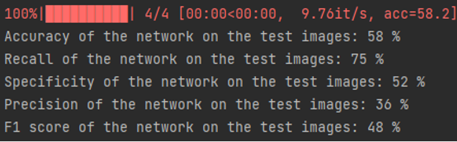

Use sigmoid() function

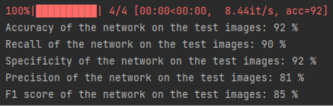

Use softmax() function

## 5.      Program of face-mask-detection model

Python and PyTorch are used to implement our face-mask-detect model. We use nn.module to build our model without importing models from OpenCV. Firstly, we build our model in the Mainmodel.py in model folder. In that model, we define our model with the layers, activation function, dropout and forward propagation. Then, we train the model in the train.py with the loss function and optimizer. The model will be saved in the MaskDetection_model of the Pretrained_model folder. During the training, the training set will be loaded by ImageFolder method. The ImageFolder will use the folder name as the label for all the images in the folder. We split the training set to training set and validation set and the validation set is 20% of the origin training set. Finally, we test our model in the test.py. In the test.py, we load the pretrain model to test the test dataset. and get the value of the accuracy, recall, specificity, precision, and F-1 score. The results are all printed. 

## 6.       Dataset:

All image data used for training/validation/testing is labeled and cropped. We downloaded the dataset from the resource: https://github.com/chandrikadeb7/Face-Mask-Detection/tree/master/dataset . Both training images and validation images are stored in the folder called training_set. That’s because we do the shuffle before each training. The accuracy of the trained model might be slightly different.

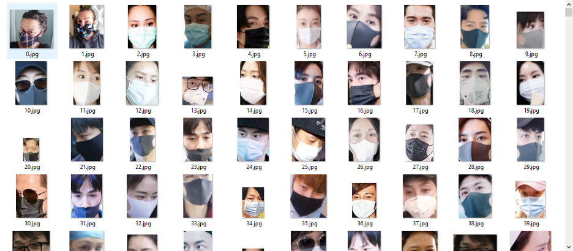

 

### 6.1. Ratio of training, validation and testing dataset

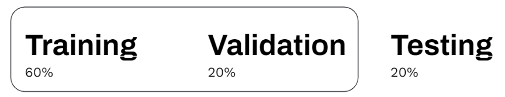

Total number of images with mask: 2165

Total number of images without mask: 1930

 

Train(60%):

Number of images with mask: 1299

Number of images without mask: 1155

 

Valid(20%):

Number of images with mask: 433

Number of images without mask: 386

 

Test(20%):

Number of images with mask: 433

Number of images without mask: 386

 

### 6.2. Overview of each dataset folder structure

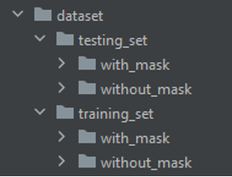 

### 6.3. Image detection test sample

We also prepared a sample dataset which is not cropped and labeled in the image_test_sample folder. 

## 7.      Application of the model

### 7.1. Video detection:

Firstly, we use the camera of the computer to get the image. Then, we will get the gray scale of the image by OpenCV and pass it to the face cascade function. The face cascade function uses the function of frontal face detection from OpenCV which is based on the

Viola Jones algorithm. Every detected face will be cropped and resized in a proper size (128*128). For each face, we will pass it to our pretrained model. If the face wears the mask, there will be a blue border rectangle on the region of the face with the label “with mask”. If the face does not wear the mask, there will a white rectangle on the region of the face with the label “without mask”.

### 7.2. Image detection:

The process is similar to the process of video detection. We will use the face detection method to detect the face first and then use our pretrained mask-detection method to detect whether the people are wearing the mask. The result will be indicated by the color of the rectangle on the region of the face and the label.

### 7.3. GUI

We use tkinter to build a simple GUI. If the user wants to detect the image, he can click the button “Choose your file” and then choose the image file on his computer.

After the user clicks the button “Predict”. The result of the image will be shown on the blank area.

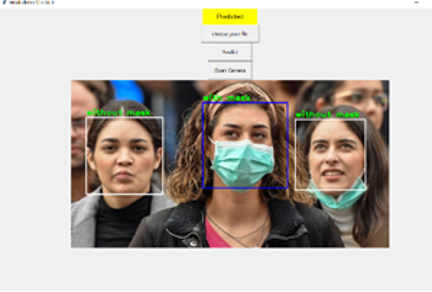
If the user chooses the button “Camera”. The video detection function will be activated.

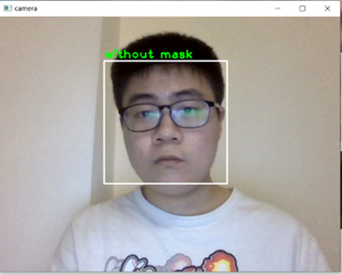

 

## 8.      Parameter Tuning

For the parameters of our model, we did some research for the CNN model. For this project, we did not develop a complex model with deep depth which may cost a lot of time and need a powerful machine. Hence, we just used two convolutional lawyers, two max pooling lawyers and a fully connected lawyer. We built our model with 16 outputs for the first lawyer and 32 outputs for the second lawyer to do some testing and the accuracy was around 90%. It took 2-3 minutes. Since we were satisfied with the accuracy and the time, we did not change the basic structure of our model. For the pooling lawyer, we used max pooling 2D lawyer with kernel size 2 and stride 2 like most people do. For the activation function, the sigmoid function only got nearly 70% accuracy and it took more time for the same episodes, so we still used the ReLu function. The reason may be that if the value is too large or too small, the gradient is too small, and it is not easy to converge. For the kernel size of the convolutional lawyer, there is no big difference between 3 and 4. For the loss function, we chose the classic Cross Entropy function. For the optimizer, there is no big difference in time and accuracy between Adagrad and SGD may be due to our model being not so complex. For the episodes, we found that the line nearly converges when episodes are 10. The accuracy was the same for 10 and 15. To save time of processing, we chose 10 as the episodes.

 

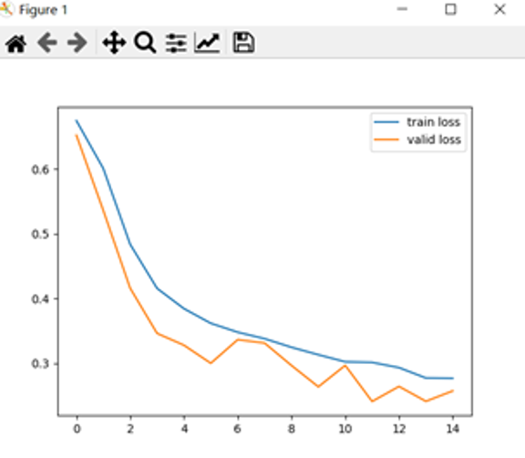

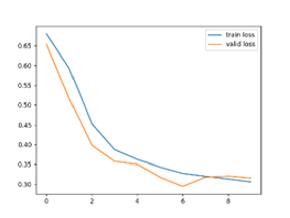

In one situation, we found that more episodes may cause overfitting problems. The validation loss got the minimum when episodes were 6. The difference between the two situations was that to run the program on one laptop, the training set deleted three photos for unknown reasons. It may be that some images in the dataset have some effects on the performance of the model.

For the face detection method, we chose the haarcascade_frontalface_default. Although it may not be the one with the highest accuracy to catch faces, it is a light model which can process very fast with satisfied accuracy and provides nearly real-time function.

## 9.      Results and discussion:

### 9.1. Mask-detection:

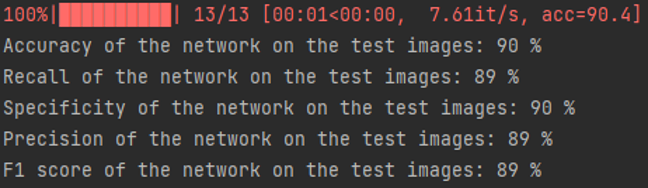

Just for the mask detection with processed images, the accuracy is around 90% and the specificity for without mask is 90%. Which means if someone does not wear a mask, we have high confidence to find him. As the picture above shows, the video detection can easily catch the people without masks. However, the recall for the mask is only 89%. After we did some testing with the video detection, there are some factors which affect the accuracy, such as bangs, long hair and glasses. The reason may be that the dataset does not have enough images with those features.

### 9.2. Face-detection

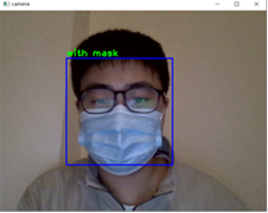
 

Although haarcascade_frontalface_default is fast and can detect many faces, it does have some limitations. Firstly, it is only for the frontal face. Secondly, in video detection, if the light is too dark or too light, it is not easy for the function to detect the edges of the face which make the function unable to catch the face. Thirdly, if someone wears a mask with different colors, the function may consider there are no masks because some features are lost after wearing masks.

### 9.3. Example and improvements to do

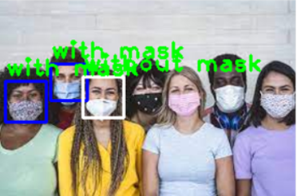

One typical example which indicates we still have something to do. Although the application has some performance in simple images with high resolutions, its performance in complex images is not so satisfactory. Firstly, many people could be detected due to the colorful mask and bright background. Secondly, there is one wrong prediction because of the long hair. For such problems, firstly, for people with masks that could not be detected, we can firstly use the eye-detection method from OpenCV and then find the area of the face or use other methods later. For the hair and glasses problem, we may need a complex model which can learn deeper features and a complex dataset which contains more features.

## 10.      Conclusion

Conclusively, it is very important for people to wear masks in public places. To check whether people wear masks, we build our CNN model with two convolutional lawyers and a fully connected lawyer. We use a dataset with nearly 4000 images to train the model. The accuracy is nearly 90% for this part. The specificity is 90% which means we have high confidence to find people who do not wear masks. The recall is 89% which is affected by the bangs, long hair and glasses. To implement our model, we build two programs for video detection and image detection and a GUI. The Viola and Jones method is used for face detection from the OpenCV. Some faces with masks are hard to detect due to the frontal face detection. To improve the performance of our program, we plan to find more images with more features , build more complex models and use more methods like eye detection to detect faces. 
